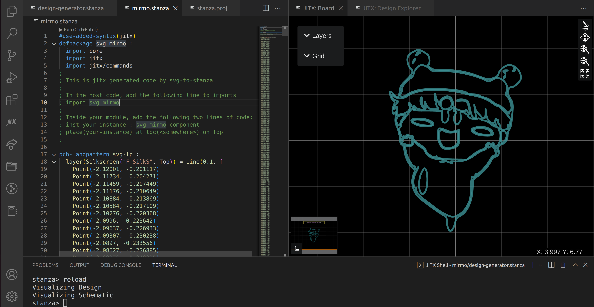

### svg-to-stanza

This is built by poet. Please install poet from https://github.com/StanzaOrg/poet

Usage: `svg-to-stanza <name-without-file-extension> [span-in-mm] [stroke-width-in-mm] [ressolution-in-mm]`
If no span, stroke-width or resolution is given, they are default to 10mm, 0.1mm, and 0.01mm respectively.

Once the .stanza file is generated, you can move it to your jitpcb design directory 
and use it by following the instruction in the .stanza file.

Dec 2022